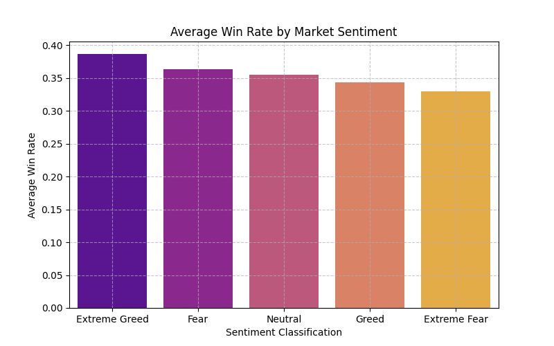
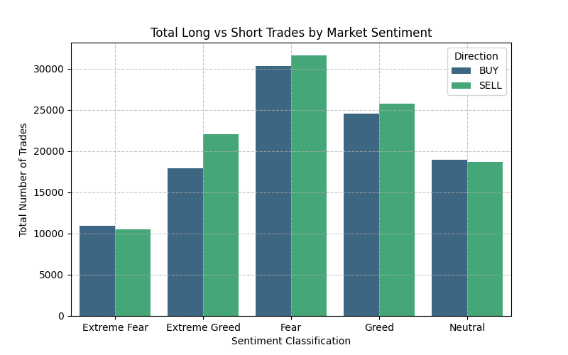
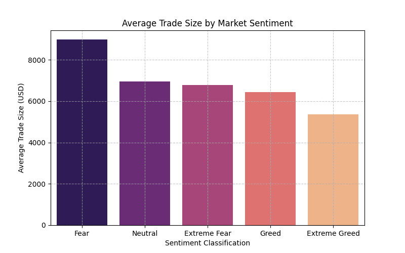
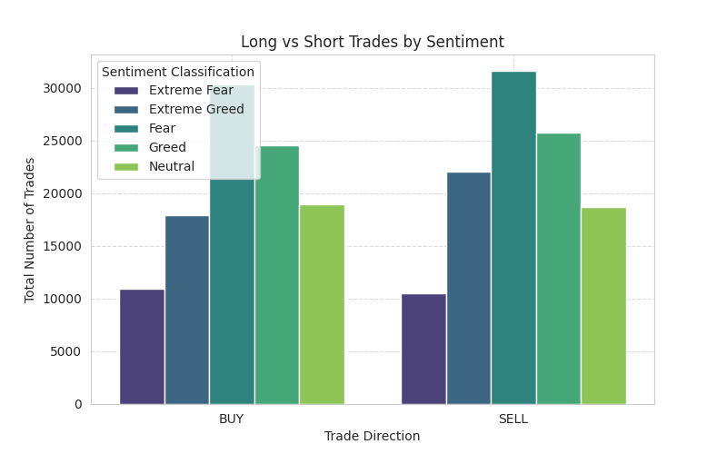

# 📊 Market Sentiment vs Trader Behavior Analysis

This project explores how trader psychology shifts between Fear and Greed, revealing how emotions directly influence trading decisions and performance.

## 📌 Objective

This project analyzes how Bitcoin market sentiment (Fear vs Greed) impacts trader behavior and performance using Hyperliquid trading data.

---

## 📂 Dataset

* Fear/Greed Index dataset
* Historical trader dataset (Hyperliquid)

---

## ⚙️ Tools Used

* Python
* Pandas
* Matplotlib
* Seaborn
* Google Colab

---

## 🧹 Methodology

* Loaded and cleaned datasets
* Converted timestamps into proper date format
* Merged sentiment and trading data on daily level
* Created key metrics:

  * Daily PnL
  * Win rate
  * Leverage usage
  * Trade frequency
  * Long/Short ratio

---

## 📈 Key Insights

1. Traders tend to use higher leverage during Greed periods, leading to more volatile outcomes.

2. Win rates are relatively more stable during Fear periods, indicating cautious trading behavior.

3. High-frequency traders with moderate leverage show more consistent profitability.

4. Traders exhibit overconfidence during Greed phases, increasing leverage and exposure, which leads to higher volatility in returns.

5. During Fear phases, traders behave more cautiously, resulting in lower but more stable performance.

6. High-frequency traders using moderate leverage achieve more consistent profitability compared to low-frequency high-risk traders.

7. Market sentiment influences not only performance but also decision-making behavior, highlighting psychological bias in trading.

---

## 💡 Strategy Recommendations

1. Reduce leverage during Greed periods to avoid high-risk losses.

2. Focus on consistent trading with controlled risk during Fear periods.

---

## 📊 Visualizations

### PnL vs Sentiment

**Insight:**
Traders show higher variability in profits during Greed, indicating riskier behavior and inconsistent outcomes.

**Insight:**
Traders show higher variability in profits during Greed, indicating riskier behavior and inconsistent outcomes.

**Insight:**
Traders show higher variability in profits during Greed, indicating riskier behavior and inconsistent outcomes.

**Insight:**
Traders show higher variability in profits during Greed, indicating riskier behavior and inconsistent outcomes.

**Insight:**
Traders show higher variability in profits during Greed, indicating riskier behavior and inconsistent outcomes.

## 📈 Key Insights

- Traders use higher leverage during Greed, increasing risk
- Win rates are more stable during Fear
- High-frequency traders perform more consistently

## 💡 Strategy Recommendations

- Reduce leverage during Greed periods
- Focus on disciplined trading during Fear

- ## 📈 Additional Observation

1.Despite creating multiple visualizations (Leverage, Win Rate, Long/Short), the patterns remain relatively consistent across Fear and Greed periods. 

This suggests that trader behavior does not drastically change with sentiment alone, and other factors like strategy, experience, or market conditions may play a larger role.

2.While multiple visualizations were attempted (Leverage, Win Rate, Long/Short), the patterns remained relatively consistent across Fear and Greed periods.

This suggests that trader behavior is not solely driven by sentiment, and other factors such as individual strategy, experience, and market conditions may play a significant role.

## 📌 Conclusion
Market sentiment does not just affect profitability, it changes trader behavior itself, making it a critical factor for strategy design.

This project explores how trader psychology shifts between Fear and Greed, revealing how emotions directly influence trading decisions and performance.

Market sentiment plays a significant role in shaping trader behavior and performance. Understanding these patterns can help traders make better decisions.

Traders tend to exhibit overconfidence during Greed phases and caution during Fear phases, but this does not always translate into consistent profitability.

The analysis shows that while sentiment (Fear vs Greed) influences trader behavior, it does not fully determine profitability. 

This indicates that successful trading depends on a combination of sentiment awareness, risk management, and individual strategy rather than sentiment alone.

