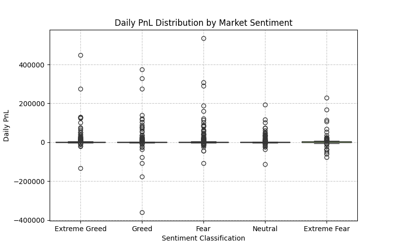

# 📊 Market Sentiment vs Trader Behavior Analysis

## 📌 Objective

This project analyzes how Bitcoin market sentiment (Fear vs Greed) impacts trader behavior and performance using Hyperliquid trading data.

---

## 📂 Dataset

* Fear/Greed Index dataset
* Historical trader dataset (Hyperliquid)

---

## ⚙️ Tools Used

* Python
* Pandas
* Matplotlib
* Seaborn
* Google Colab

---

## 🧹 Methodology

* Loaded and cleaned datasets
* Converted timestamps into proper date format
* Merged sentiment and trading data on daily level
* Created key metrics:

  * Daily PnL
  * Win rate
  * Leverage usage
  * Trade frequency
  * Long/Short ratio

---

## 📈 Key Insights

1. Traders tend to use higher leverage during Greed periods, leading to more volatile outcomes.

2. Win rates are relatively more stable during Fear periods, indicating cautious trading behavior.

3. High-frequency traders with moderate leverage show more consistent profitability.

---

## 💡 Strategy Recommendations

1. Reduce leverage during Greed periods to avoid high-risk losses.

2. Focus on consistent trading with controlled risk during Fear periods.

---

## 📊 Visualizations

## 📌 Conclusion

Market sentiment plays a significant role in shaping trader behavior and performance. Understanding these patterns can help traders make better decisions.

